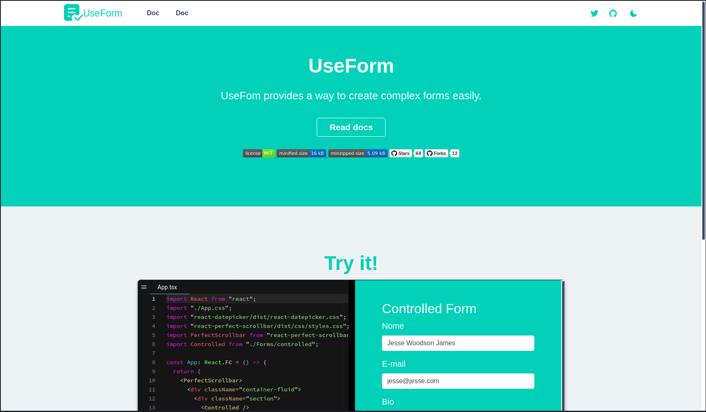
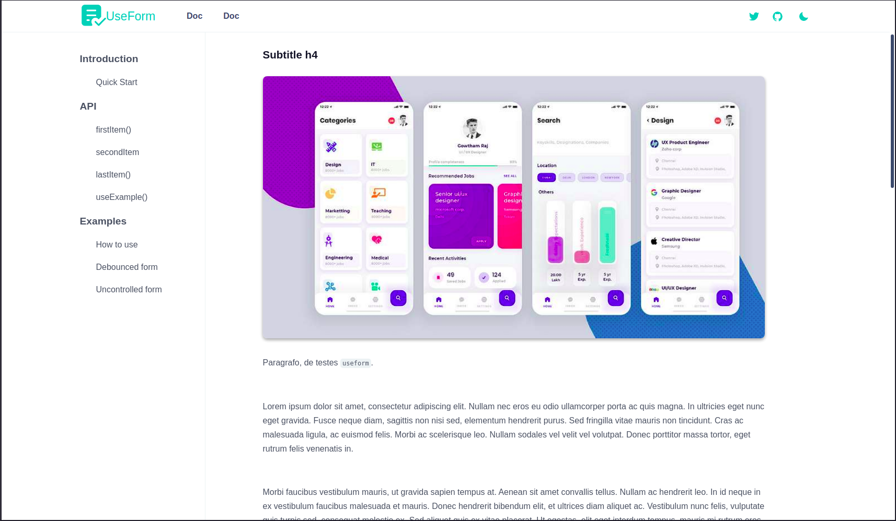
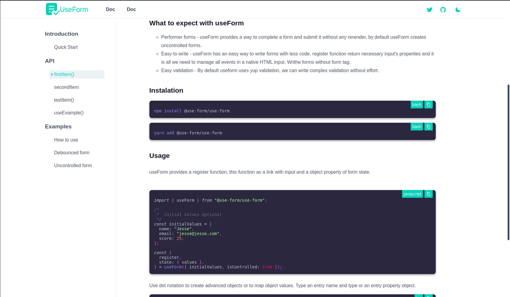
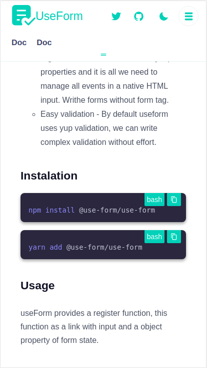
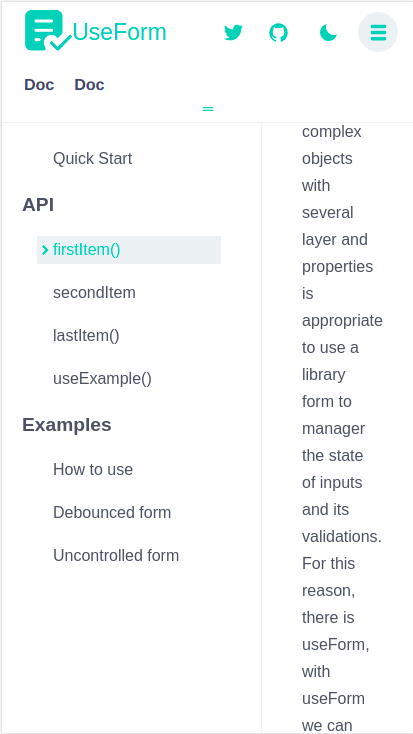

# Next Documentation Library Starter

Next Library starter is a repository that provide a initial effort to make beautiful documentations, form react components or library.


## Technologies

- [ReactJS](https://reactjs.org/)
- [Next.js](https://nextjs.org/)
## 💻 Getting started

### Requirements

- You need to install both [Node.js](https://nodejs.org/en/download/) and [Yarn](https://yarnpkg.com/) to run this project.

## Demo https://next-lib-doc-starter.vercel.app/

First, run the development server:

```bash
yarn

yarn dev
```
The app will be available for access on your browser at http://localhost:3000








Made with 💜 by Jucian0 👋 [Check out my Twitter](https://twitter.com/juciano_barbosa)